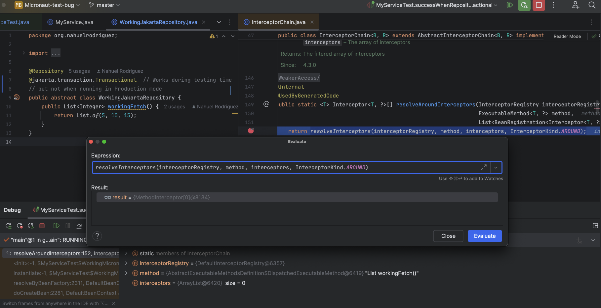
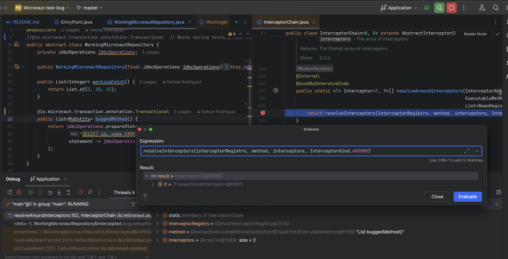
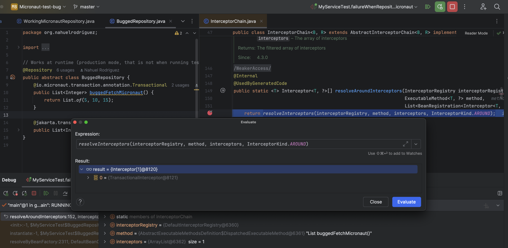

## Micronaut Data/Test bugs PoC

Hi there! I noticed a couple of bugs related to Micronaut Data and/or Test involving the annotation `@Transactional`.
I opened 2 bug reports (with one duplicated in a different repo since I'm not exactly sure where it belongs):

- [Micronaut Data #2943](https://github.com/micronaut-projects/micronaut-data/issues/2943).
- [Micronaut Core #10813](https://github.com/micronaut-projects/micronaut-core/issues/10813).
- [Micronaut Test #1025](https://github.com/micronaut-projects/micronaut-test/issues/1025) (duplicated from previous
  one).

## Bug test cases

| Annotation / Annotated on | Repository | Repository method | Tests execution result [^2] | Production execution result |
|---------------------------|------------|-------------------|-----------------------------|-----------------------------|
| `@Transactional` [^1]     | Yes        | No                | Pass                        | Fail                        |
| `@Transactional` [^1]     | No         | Yes               | Fail                        | Works well                  |
| `@Transactional` [^1]     | Yes        | Yes               | Fail                        | Works well                  |

[^1]: It doesn't matter whether it's `@jakarta.transaction.Transactional`
or `@io.micronaut.transaction.annotation.Transactional`.

[^2]: Tests mock repositories with `@MockBean(RepositoryClass.class)`.

## More information

I did some debugging and I discovered that a `TransactionalInterceptor` is applied or not depending on
where `@Transactional` is put (when `@MockBean` is used).

## First bug test case

### Debugger result



### Autogenerated code

```java
package io.github.nahuel92;

import io.micronaut.aop.Interceptor;
import io.micronaut.aop.InterceptorRegistry;
import io.micronaut.aop.Introduced;
import io.micronaut.context.BeanContext;
import io.micronaut.context.BeanResolutionContext;
import io.micronaut.context.Qualifier;
import io.micronaut.core.annotation.Generated;
import io.micronaut.data.jdbc.runtime.JdbcOperations;
import io.micronaut.inject.ExecutableMethod;

import java.util.List;

@Generated
class WorkingMicronautRepository$Intercepted extends WorkingMicronautRepository implements Introduced {
  private final Interceptor[][] $interceptors = new Interceptor[0][];
  private final ExecutableMethod[] $proxyMethods = new ExecutableMethod[0];

  public WorkingMicronautRepository$Intercepted(JdbcOperations var1, BeanResolutionContext var2, BeanContext var3, Qualifier var4, List var5, InterceptorRegistry var6) {
    super(var1);
  }
}
```

Previous autogenerated code will allow tests to pass, but it will make runtime execution to fail
with
`io.micronaut.data.connection.exceptions.NoConnectionException: Expected an existing connection, but none was found.`

### Debugger result (with method annotated with `@Transactional`)



### Autogenerated code

```java
package io.github.nahuel92;

import io.micronaut.aop.Interceptor;
import io.micronaut.aop.InterceptorRegistry;
import io.micronaut.aop.Introduced;
import io.micronaut.aop.chain.InterceptorChain;
import io.micronaut.aop.chain.MethodInterceptorChain;
import io.micronaut.context.BeanContext;
import io.micronaut.context.BeanResolutionContext;
import io.micronaut.context.Qualifier;
import io.micronaut.core.annotation.Generated;
import io.micronaut.data.jdbc.runtime.JdbcOperations;
import io.micronaut.inject.ExecutableMethod;

import java.util.List;

@Generated
class WorkingMicronautRepository$Intercepted extends WorkingMicronautRepository implements Introduced {
  private final Interceptor[][] $interceptors = new Interceptor[1][];
  private final ExecutableMethod[] $proxyMethods = new ExecutableMethod[1];

  public List buggedMethod() {
    return (List) (new MethodInterceptorChain(this.$interceptors[0], this, this.$proxyMethods[0])).proceed();
  }

  public WorkingMicronautRepository$Intercepted(JdbcOperations var1, BeanResolutionContext var2, BeanContext var3, Qualifier var4, List var5, InterceptorRegistry var6) {
    super(var1);
    WorkingMicronautRepository.Intercepted.Definition.Exec var7 = new WorkingMicronautRepository.Intercepted.Definition.Exec(true);
    this.$proxyMethods[0] = var7.getExecutableMethodByIndex(0);
    this.$interceptors[0] = InterceptorChain.resolveAroundInterceptors(var6, this.$proxyMethods[0], var5);
  }
}
```

## Second bug test case

### Debugger result



### Autogenerated code

```java
package io.github.nahuel92;

import io.micronaut.aop.Interceptor;
import io.micronaut.aop.InterceptorRegistry;
import io.micronaut.aop.Introduced;
import io.micronaut.aop.chain.InterceptorChain;
import io.micronaut.aop.chain.MethodInterceptorChain;
import io.micronaut.context.BeanContext;
import io.micronaut.context.BeanResolutionContext;
import io.micronaut.context.Qualifier;
import io.micronaut.core.annotation.Generated;
import io.micronaut.inject.ExecutableMethod;

import java.util.List;

@Generated
class BuggedRepository$Intercepted extends BuggedRepository implements Introduced {
  private final Interceptor[][] $interceptors = new Interceptor[2][];
  private final ExecutableMethod[] $proxyMethods = new ExecutableMethod[2];

  public List buggedFetchMicronaut() {
    return (List) (new MethodInterceptorChain(this.$interceptors[0], this, this.$proxyMethods[0])).proceed();
  }

  public List buggedFetchJakarta() {
    return (List) (new MethodInterceptorChain(this.$interceptors[1], this, this.$proxyMethods[1])).proceed();
  }

  public BuggedRepository$Intercepted(BeanResolutionContext var1, BeanContext var2, Qualifier var3, List var4, InterceptorRegistry var5) {
    BuggedRepository.Intercepted.Definition.Exec var6 = new BuggedRepository.Intercepted.Definition.Exec(true);
    this.$proxyMethods[0] = var6.getExecutableMethodByIndex(0);
    this.$interceptors[0] = InterceptorChain.resolveAroundInterceptors(var5, this.$proxyMethods[0], var4);
    this.$proxyMethods[1] = var6.getExecutableMethodByIndex(1);
    this.$interceptors[1] = InterceptorChain.resolveAroundInterceptors(var5, this.$proxyMethods[1], var4);
  }
}
```

We can see how the constructor calls the `resolveAroundInterceptors` method.

## Third bug test case

As it is a combination of previous 2 test cases, I haven't looked into it (I suspect it will be fixed once previous ones
are fixed).

## Application example

This application uses Java 21, Micronaut 4.4.2 (latest at the time of writing), Maven and Liquibase to simplify
developers workflow.

### How to test?

- You can go ahead and run all tests under `src/test/java` and you will see a couple of failing tests. This is the first
  bug test case.
- You can export `MICRONAUT_ENVIRONMENTS=prod` (see `.env` file) and run the application. This is the second test case.

> **Important:** Second bug test case can't be caught during testing (at least, I couldn't figure out how to do so),
> which makes it quite concerning.